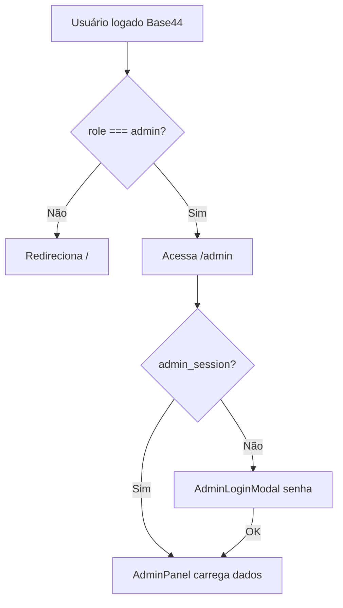

# Integração — Área do Administrador (Luditeca / Mundo Lúdico)

Documento de repasse para integrar **front e back** da Área do Administrador em outra aplicação. Stack atual: **React (Vite)** + **Base44 SDK** (`@base44/sdk`) como BaaS.

---

## 1. Visão geral

A Área do Administrador permite que usuários com `role === 'admin'` gerenciem conteúdo educativo consumido pelo app infantil:

| Módulo | Entidade Base44 | Uso no app (criança) |
|--------|-----------------|----------------------|
| Livros | `Book` | Biblioteca (`/library`) — só `is_published: true` |
| Atividades custom | `Activity` | Atividades (`/activities`) — quiz, flashcard, etc. |
| LIBRAS | `LibrasLesson` | Atividade LIBRAS e páginas de livros |
| Quebra-cabeça | `PuzzleGame` | `/activity/puzzle` |
| Pinturas | `ColoringPage` | `/activity/coloring` (merge com SVGs padrão) |

---

## 2. Autenticação e controle de acesso

### 2.1 Camada 1 — Base44 (obrigatória)

- O usuário logado deve ter **`user.role === 'admin'`** (via `AuthContext` / `base44.auth`).
- Sem essa role, `AdminPanel` redireciona para `/`.
- O card **“Área do Administrador”** na Home só aparece se `isAdmin` (`src/pages/Home.jsx`).

### 2.2 Camada 2 — Senha local (complementar, apenas UI)

| Chave `localStorage` | Valor | Uso |
|----------------------|-------|-----|
| `admin_session` | `'true'` | Sessão após login no modal |
| `admin_password` | string (4–6 chars) | Definida em “Alterar senha” no painel |

**Senha padrão no modal:** `0000` (`src/components/AdminLoginModal.jsx`).

> **Atenção para integração:** o modal de login valida **apenas** `0000`. A alteração de senha grava `admin_password`, mas o login **não** lê essa chave hoje. Ao integrar em outro app, unificar em um único fluxo (ex.: senha no backend ou sempre checar `localStorage.admin_password ?? '0000'`).

### 2.3 Fluxo de acesso



---

## 3. Rotas (frontend)

Definidas em `src/App.jsx`:

| Rota | Componente | Função |
|------|------------|--------|
| `/admin` | `AdminPanel` | Dashboard com abas e listagens |
| `/admin/book/:id` | `BookEditor` | `id=new` cria; senão edita |
| `/admin/libras/:id` | `LibrasEditor` | `id=new` cria; senão edita |
| `/admin/activity/:id` | `ActivityEditor` | `id=new` cria; senão edita |

**Atalhos no painel:**

- Novo livro → `/admin/book/new`
- Nova LIBRAS → `/admin/libras/new`
- Nova atividade → `/admin/activity/new`

---

## 4. Arquivos principais (mapa para portar)

```
src/pages/AdminPanel.jsx          # Hub principal
src/components/AdminLoginModal.jsx
src/pages/BookEditor.jsx          # + components/book-editor/*
src/pages/ActivityEditor.jsx
src/pages/LibrasEditor.jsx
src/components/admin/ColoringPagesManager.jsx
src/components/admin/PuzzleGameManager.jsx
src/api/base44Client.js
src/lib/AuthContext.jsx
src/lib/coloringPages.js          # merge páginas padrão + custom
base44/entities/*.jsonc           # schemas oficiais das entidades
```

---

## 5. API / Backend (Base44)

Cliente: `src/api/base44Client.js`

```javascript
import { createClient } from '@base44/sdk';
export const base44 = createClient({
  appId, token, functionsVersion,
  serverUrl: '',
  requiresAuth: false,
  appBaseUrl
});
```

Parâmetros: `src/lib/app-params.js` (`app_id`, `access_token`, `VITE_BASE44_*`).

### 5.1 Upload de arquivos

Usado em livros, atividades, LIBRAS, puzzle e pinturas:

```javascript
const { file_url } = await base44.integrations.Core.UploadFile({ file });
```

### 5.2 Operações CRUD por entidade

| Entidade | Listar (admin) | Criar | Atualizar | Deletar | Publicar |
|----------|----------------|-------|-----------|---------|----------|
| `Book` | `list()` | `create(payload)` | `update(id, payload)` | `delete(id)` | toggle `is_published` |
| `Activity` | `list()` | `create(act)` | `update(id, act)` | `delete(id)` | toggle `is_published` |
| `LibrasLesson` | `list('order')` | `create(form)` | `update(id, form)` | `delete(id)` | — |
| `PuzzleGame` | `list()` | `create(formData)` | `update(id, data)` | `delete(id)` | toggle `is_published` |
| `ColoringPage` | `list('-updated_date')` | `create(...)` | `update(id, ...)` | soft: `is_published: false` | toggle `is_published` |

**Leitura no app infantil (filtro publicado):**

```javascript
base44.entities.Book.filter({ is_published: true })
base44.entities.Activity.filter({ is_published: true })
base44.entities.PuzzleGame.filter({ is_published: true })
base44.entities.ColoringPage.filter({ is_published: true })
// Libras: list('order') na atividade LIBRAS
```

---

## 6. Schemas das entidades

Schemas em `base44/entities/`. Resumo dos campos críticos:

### 6.1 Book

- **Tipos:** `book_type`: `animated` | `interactive` | `digital`
- **Campos:** `title`, `description`, `cover_url`, `category`, `age_range`, `pages[]`, `quiz[]`, `is_published`, `pdf_url`, `epub_url`, `soundtrack_url`
- **Página (`pages[]`):** `page_number`, `image_url`, `is_gif`, `text`, `narration_url`, `page_type` (`reading`|`activity`|`painting`), `activity_type`, `activity_data`, `scene_id`, `choices[]`, `is_start`, `is_ending`
- **Quiz do livro:** `question`, `options[]`, `correct` (índice)

**Editor:** escolhe tipo → abas páginas/quiz → upload em lote de imagens/GIFs → `Book.create` ou `Book.update`.

### 6.2 Activity

- **Tipos:** `quiz` | `flashcard` | `matching` | `trueFalse` | `fillBlank` (editor UI usa subset: quiz, trueFalse, fillBlank, flashcard)
- **Campos:** `title`, `description`, `icon` (emoji), `type`, `questions[]`, `is_published`, `badge_reward`, `book_id`
- **Pergunta:** `question`, `image_url`, `options[]`, `correct`, `answer`

**Player:** `/activity-game/:id` (`ActivityPlayer`).

### 6.3 LibrasLesson

- **Campos:** `word`, `category`, `image_url`, `description`, `quiz_question`, `quiz_options[]`, `quiz_correct`, `order`
- **Ordenação:** `list('order')`

### 6.4 PuzzleGame

- **Campos:** `title`, `description`, `image_url`, `piece_count` (15|30|60|120|240), `caption`, `is_published`
- **Obrigatórios:** `title`, `image_url`

### 6.5 ColoringPage

- **Campos:** `title`, `image_url`, `default_id` (substitui SVG padrão), `svg_type`, `is_published`
- **Padrões embutidos:** `src/lib/coloringPages.js` (`DEFAULT_COLORING_PAGES` + `mergeColoringPages`)
- Admin pode criar override de tela padrão via `default_id` + `svg_type`

---

## 7. Funcionalidades por aba (AdminPanel)

### Aba 📚 Livros

- Lista todos os livros
- Publicar/despublicar (`is_published`)
- Editar → `BookEditor`
- Excluir (otimistic UI + `Book.delete`)

### Aba 🤟 LIBRAS

- Lista lições ordenadas
- Editar / excluir
- Sem toggle de publicação (sempre visível se existir na lista da atividade)

### Aba 🎯 Atividades

- Lista atividades custom
- Publicar/despublicar, editar, excluir

### Aba 🧩 Quebra-Cabeça (`PuzzleGameManager`)

- CRUD inline com modal
- Upload imagem, escolha de peças, legenda
- Publicar/despublicar

### Aba 🖌️ Pinturas (`ColoringPagesManager`)

- Lista merge (padrão + custom via `getEditableColoringPages`)
- Criar/editar com upload
- Publicar = ocultar/mostrar para crianças
- “Excluir” padrão = criar registro com `is_published: false` e `default_id`

### Ações globais no painel

- **Alterar senha** → `localStorage.admin_password` (mín. 4 caracteres)
- **Sair** → remove `admin_session`

---

## 8. Dependências de UI/contexto

Para portar o front, replicar ou substituir:

- `ThemeContext` — cores dinâmicas por perfil
- `AuthContext` — `user`, `role`
- `react-router-dom` — rotas acima
- `framer-motion` — animações (opcional)
- `lucide-react` — ícones
- Componentes shadcn em `src/components/ui/*` (indiretos nos editores)

---

## 9. Checklist de integração na outra aplicação

### Backend / BaaS

- [ ] Mesmo `appId` Base44 ou migração de entidades equivalentes
- [ ] Endpoints CRUD para as 5 entidades com mesmos campos
- [ ] Upload de mídia (imagens, áudio, PDF, EPUB)
- [ ] Autorização: apenas `admin` em rotas de escrita
- [ ] Filtro `is_published` nas rotas públicas/infantis

### Frontend

- [ ] Rotas `/admin`, `/admin/book/:id`, `/admin/libras/:id`, `/admin/activity/:id`
- [ ] Guard `role === 'admin'`
- [ ] Modal de senha (ou SSO) — corrigir bug senha local se reutilizar
- [ ] Portar `AdminPanel` + 2 managers + 3 editores + `book-editor/*`
- [ ] Conectar listagens ao client da API nova
- [ ] Testar ciclo: criar → publicar → ver na Library/Activities/Puzzle/Coloring

### Segurança (recomendado na integração)

- [ ] Não depender só de `localStorage` para senha admin
- [ ] Validar `role` no servidor em toda mutação
- [ ] Rate limit em upload

---

## 10. Pontos de atenção / dívidas técnicas

1. **Senha admin:** login fixo `0000`; `admin_password` não é usada no login.
2. **BookEditor carrega livro:** usa `Book.list()` e `find` por id (não `filter({ id })`) — em bases grandes, preferir `filter` na integração.
3. **Activity schema** inclui `matching`, mas o editor não expõe esse tipo na UI.
4. **Libras** não tem `is_published` — controle de visibilidade é por existência na lista ordenada.
5. **ColoringPage delete** em itens padrão cria registro de override, não apaga SVG embutido.

---

## 11. Variáveis de ambiente

```env
VITE_BASE44_APP_ID=
VITE_BASE44_FUNCTIONS_VERSION=
VITE_BASE44_APP_BASE_URL=
```

Token de acesso: query `access_token` ou `localStorage` (`base44_access_token`).

---

## 12. Referência rápida de consumo (app infantil)

| Conteúdo admin | Onde a criança vê |
|----------------|-------------------|
| Livro publicado | `Library.jsx` → `/book/:id` |
| Atividade publicada | `Activities.jsx` → `/activity-game/:id` |
| Puzzle publicado | `ActivityPuzzle.jsx` |
| Pintura publicada | `ActivityColoring.jsx` + `mergeColoringPages` |
| Lição LIBRAS | `ActivityLibras.jsx` / páginas de livro `activity_type: libras` |

---

*Gerado a partir do código em `cheerful-mundo-ludico-play`. Atualize este doc quando alterar entidades ou rotas admin.*
